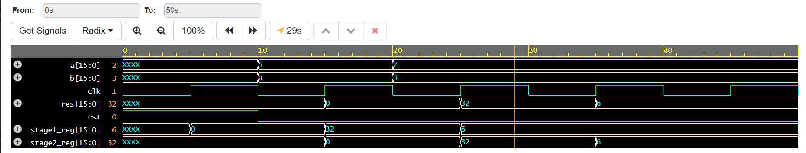

# High-Speed Pipelined 8x8 Floating-Point Multiplier Core

## 📌 Project Overview
This repository contains a high-performance, IEEE 754-compliant floating-point multiplier core implemented in Verilog. The design leverages a **multi-stage pipeline architecture** to maximize throughput and minimize critical path propagation delays, making it suitable for high-frequency digital signal processing (DSP) applications.

## ⚡ Technical Architecture
* **Design Approach:** Pipelined hardware architecture, breaking down complex multiplication into discrete processing stages.
* **Pipeline Stages:** 1. **Stage 1 (Unpack & Multiply):** Mantissa multiplication and exponent extraction.
    2. **Stage 2 (Normalize & Round):** Exponent adjustment and IEEE 754 rounding logic.
* **Performance Focus:** Optimization of internal register placements to increase maximum clock frequency ($F_{max}$).

## 📊 Verification Results
The verification testbench confirms correct data propagation through the pipeline stages, with appropriate latency cycles.



## 🛠️ How to Replicate
1. **Access the design:** Copy the source code from the `rtl/` and `tb/` folders into [EDA Playground](https://www.edaplayground.com/).
2. **Configure Simulator:** Select **Icarus Verilog 12.0** as the simulator.
3. **Run Simulation:** Execute the simulation to view timing diagrams in EPWave.
4. **Analyze Latency:** Observe the register-to-register data movement in the timing waveforms to verify the pipeline operation.

## 📈 Engineering Impact
* **Throughput Optimization:** By utilizing a pipelined approach, the core achieves a throughput of one operation per clock cycle once the pipeline is primed.
* **Timing Closure:** The insertion of intermediate pipeline registers significantly reduces the critical path, allowing the design to meet timing constraints at higher clock speeds compared to a non-pipelined combinatorial implementation.

## 📂 Repository Structure
```text
├── rtl/                # Verilog source code for the multiplier
├── tb/                 # SystemVerilog testbench for verification
├── assets/             # Simulation screenshots and diagrams
├── LICENSE             # MIT License
└── README.md           # Project documentation
